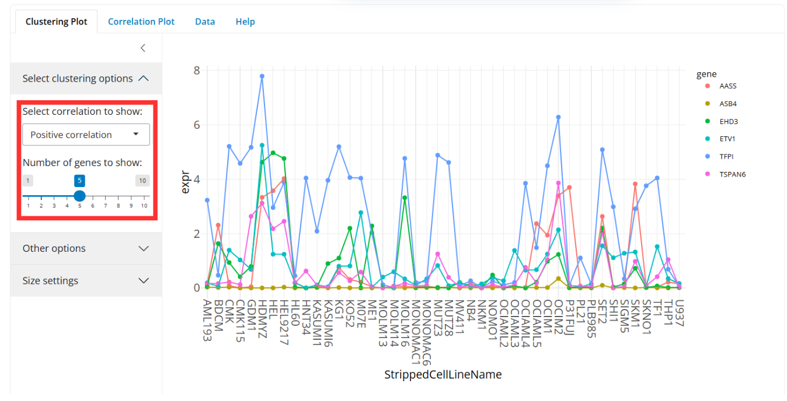

# DepMap Data Dashboard

## Authors: 

- [Yamila Timmer](https://github.com/YamilaTimmer)
- [Mirte Draaijer](https://github.com/MirteDraaijer)


## Description

This data dashboard aims to visualize large batches of DepMap data, specifically the newest gene expression dataset (DepMap Public 25Q2). The dashboard offers an interactive user interface and contains extensive documentation on how it can be used, with tutorials in this README and in the app. This data dashboard can compare cell lines derived from cancer types and gene expression. While visualizing large amounts of data has proven to be difficult, the DepMap Data Dashboard is a tool that allows users to visualize DepMap data in various ways, from more 'standard' plots such as bar plots, boxplots, and heatmaps, to comparing entire pathways and finding similar gene expression profiles. Users can do all of this while filtering on specific metadata to include/exclude the data, as the user wishes. 

### Key-features
- Visualise large batches of DepMap data,
- Allows selecting different metadata parameters, to fine-tune data,
- Generating basic expression plots with the data, including bar plots, boxplots, violin plots, and heatmaps,
- Finding genes with a similar expression profile to a chosen gene (either positive or negative correlation),
- Comparing gene expression profiles between selected genes,
- Comparing pathways between two cancer types, where all involved genes are automatically selected,
- Generating sortable tables with the filtered data,
- The ability to save the generated visuals (.png) and the table data (.csv/.xlsx),
- User-friendly dashboard interface.

### DepMap
The [Dependency Map](https://depmap.org/portal/) (DepMap) portal offers large batches of open-access cancer research data, to support new scientific discoveries within the field. The goal is to map the 'landscape' of cancer vulnerabilities, through different approaches:

- Capturing genetic and molecular diversity of human cancer, by gathering more than 2000 different models
- Identifying genes that are required for cell growth and drug sensitivities
- Creating a map of cancer vulnerabilities
- Identifying genetic and molecular alterations in cancer cells

If you would like to learn more about these running DepMap projects, it is highly recommended you visit [their website](https://depmap.org/portal/home/#/our-approach).

## System requirements and installation

### System requirements

- OS: Linux or Windows 11
- R: 4.0 or higher
- 10 GB of free disk space 

## Installation

The dashboard can be installed as an R-package. For this, the R-package [devtools](https://github.com/r-lib/devtools) (v. 2.4.5) is needed.

```r
install.packages("devtools")
library(devtools)
```

Now, using devtools the package can be installed from the GitHub repo.

```r
devtools::install_github("YamilaTimmer/depmap-dashboard")
library(depmapdashboard)
```

Lastly, the working directory needs to be set to the package and then the dashboard can be started.
```r
setwd(system.file(package = "depmapdashboard"))
depmapdashboard::run_app()
```

### Version details
The application is made using R version [4.4.0](https://cran.r-project.org/bin/windows/base/) (Puppy Cup) and the following R packages are integrated into the data dashboard:

| Package Name        | Description                                                 | Version   |
|---------------------|-------------------------------------------------------------|-----------|
| [AnnotationDbi](https://github.com/Bioconductor/AnnotationDbi) | For querying SQLite-based annotation data packages | 1.66.0|
| [Biocmanager](https://github.com/Bioconductor/BiocManager) | For installing/managing Bioconductor packages | 1.30.26 |
| [bsicons](https://github.com/rstudio/bsicons)| Used to add icons to application |0.1.2|
| [bslib](https://github.com/rstudio/bslib/) | Used for layout/structuring of application  |0.9.0|
| [dplyr](https://github.com/tidyverse/dplyr) | Used for various methods of data manipulation |1.1.4|
| [DT](https://github.com/rstudio/DT)| Used for interactive data table output in application |0.33|
| [feather](https://github.com/wesm/feather)| Package that allows storing/reading data more efficiently|0.3.5|
| [forcats](https://github.com/tidyverse/forcats) | Merging uncommon factors into "other" (used in homepage piechart)|1.0.0|
| [ggplot2](https://github.com/tidyverse/ggplot2)| Used for making all plots (bar plot, boxplot, violin plot, heatmap)|3.5.2|
| [limma](https://bioconductor.org/packages/release/bioc/html/limma.html) |Data analysis for omics data|3.60.6| 
| [org.Hs.eg.db](https://bioconductor.org/packages/release/data/annotation/html/org.Hs.eg.db.html)|Genome wide annotation for humane genome|3.19.1|
| [paletteer](https://github.com/EmilHvitfeldt/paletteer)|Collection of color palettes for plots|1.6.0|
| [plotly](https://github.com/plotly/plotly.R)| Package that allows creating interactive graphs |4.11.0|
| [Shiny](https://github.com/rstudio/shiny) | Package that allows creating interactive R applications |1.10.1|
| [shinycssloaders](https://github.com/daattali/shinycssloaders)| Used for adding loading icons in application |1.1.0|
| [shinyjs](https://github.com/daattali/shinyjs) | Improves user experience, using JavaScript|2.1.0|
| [tidyr](https://github.com/tidyverse/tidyr)|For converting data to 'tidy' format|1.3.1|


## Usage
### Use-cases
This dashboard offers three types of use-cases, which can be selected in a dropdown menu on the left side. 

- `Explore expression`:
This usecase allows for exploring the expression of one or more genes across one or more cancer types. Included in this use-case is visualization using 'summary plots' (bar plots, box plots and violin plots) or a heatmap.

- `Gene clustering`:
This usecase allows for exploring the correlation between expression profiles across genes, in order to see what genes are most positively/negatively related to a selected gene. A positive relation meaning that the gene expression profile of the selected gene is similar to that of the shown genes and a negative relation meaning the expression profile of the selected gene is inverted to that of the shown genes. This is useful for finding genes with possible similar functions. The usecase also allows for visualization of distribution of cell line expression between two selected genes.

- `Compare pathways`:
This usecase allows for comparing expression in entire pathways across two selected cancer types. The selected cancer types determine what cell lines are selected and the selected pathway will automatically select all genes that belong to that pathway, the result gets visualized as a heatmap. Here it's also possible to filter on p-value <= 0.05.


### Select Parameters
Use the sidebar to select the wanted genes, cancer types, and additional demographic filters, including patient sex, race, and age category. The use-case determines how many genes/cancer types can be selected in total.

- **Genes**: include a total of 19194 humane genes
- **Cancer types** (OncotreePrimaryDisease): contains a plethora of different cancer diseases of which the cell lines were extracted 
- **Sex**: biological sex the patient was born with, contains 3 options, 'Female', 'Male', and 'unknown' (due to some missing values). 'Male' and 'Female' are selected by default.
- **Ethnic background**: contains the following options: 'caucasian', 'asian', 'black_or_african_american', 'african', 'american_indian_or_native_american', 'east_indian', 'north_african' and unknown (due to some missing values)
- **Age category**: age category of the patient, contains 4 options: 'Fetus', 'Pediatric', 'Adult' and unknown (due to some missing values)


> The DepMap dataset contains some missing values in the metadata, 'Unknown' is retained in the data, to allow larger amounts of data to be visualized and is by default selected for sex, ethnic background, and age category. Feel free to unselect 'Unknown' if you want to filter on a specific sex, ethnic background, or age category.

After selecting the parameters, the sidebar can be collapsed to allow more space for the visualization and data table.


## Generate Visualizations

### Usecase: Explore expression

**Summary plots**

  1. Select the type of plot to generate in the `select plot type` dropdown menu (options: barplot, boxplot/violin plot)
  2. Further options can be selected, in the sidebar on the left (`Other options`), such as color palette and how to scale the y-axis when multiple genes are selected.
  3. The visualization can be resized by dragging the height/width sliders under `size settings`
  4. The visualization can be saved by pressing the 'save as .png' button


**Heatmap**
  
  1. A color palette can be selected in the sidebar on the left
  2. The visualization can be resized by dragging the height/width sliders under `size settings`
  3. The visualization can be saved by pressing the 'save as .png' button


### Usecase: Gene clustering

**Clustering Plot**
  
  1. Under `Select clustering options`, select whether you want to find the genes with the most positive or most negative correlation to the target gene.
  2. In the same menu, select the number of similar genes you want to be shown, from at minimum 1 to maximum 10, not counting the target gene.
  3. The visualization can be resized by dragging the height/width sliders under `size settings`
  4. The visualization can be saved by pressing the 'save as .png' button.



**Correlation Plot**

  1. Select the target gene in the `Select gene` dropdown menu under the `Select usecase` dropdown, this gene will be on the x-axis of the plot
  2. Select the query gene in the `Select correlation options` dropdown, at 'Select gene to compare with', this gene will be on the y-axis of the plot
  3. Further options can be selected, in the sidebar on the left (`Other options`), such as adding a border around the plot or choosing whether or not to display cell line labels.
  4. The visualization can be resized by dragging the height/width sliders under `size settings`
  5. The visualization can be saved by pressing the 'save as .png' button.


### Usecase: Compare pathways

**Heatmap**
  
  1. A color palette can be selected under `Select options`
  2. In the same menu, a checkbox can be clicked to only show genes with a p-value ≤ 0.05
  3. The visualization can be resized by dragging the height/width sliders under `size settings`
  4. The visualization can be saved by pressing the 'save as .png' button


## Explore data
View the data that is generated for the selected parameters, in the table on the right side. The data table can be viewed in full screen by pressing the 'expand' button in the bottom right of the tab. What columns will be displayed can be chosen in the `column selector` at the top. Clicking the `reset to default columns`, will make the column selection revert to the default columns, which include the cell line name (StrippedCellLineName), the cancer type (OncotreePrimaryDisease), the gene, the expression, and a research column that links to a PubMed search for the gene. The data can be sorted on columns from low/high, or you can perform a specific search using the search bar in the top right. Additional metadata can be viewed in the table, by choosing additional columns in the column selector.  A short description for all columns can be found in the [appendix](README.md#appendix). Keep in mind, that some columns have a lot of missing values (NA values).


All use cases include the same columns and `compare pathways` contains two additional columns containing the p-value and log2 fold change.


The data can be sorted by clicking the arrows next to the column names (from high-low or low-high) and by clicking the gene names a new window will open with a link to [https://www.genecards.org/](https://www.genecards.org/) with the page corresponding to the selected gene, for more information about the gene. Clicking the link in the research column will lead to a [PubMed](https://pubmed.ncbi.nlm.nih.gov/) search of that protein + the word 'cancer'. 

### Saving the data
Using the download button under the `data` tab, the data can be saved as either a comma-separated-value (.csv) file, or an Excel file (.xslx).


# How to interpret the data
## Background info

This application shows gene expression over cell lines and can be used to interpret certain relations between gene expression and different cancer types. The application also allows filtering on age category, sex, and ethnic background, so relations might also be found. Please see the [appendix](README.md#appendix) or the application for all possible options within these filters.

A gene is a piece of DNA that codes for a protein. **Gene expression** means how much a gene is transcripted to RNA and then translated to a protein. The more this occurs, the higher a gene is expressed. Cancer can be linked to gene expression. For example, certain genes that prevent cancer (tumor-suppressor genes) might not be expressed as much in patients with cancer. It also works the other way around, genes that can cause cancer (oncogenes) are often seen in higher expression levels in patients with cancer. The expression of the genes can be found in `OmicsExpressionProteinCodingGenesTPMLogp1.csv`.

The **cell lines** refer to populations of cells that are derived from patients with different types of cancer. This allows for 'in vitro' research, which is done outside of the patient, which has the benefit that it can be studied without potentially harming the patient. Information about the cell lines can be found in `Model.csv`. 

## Examples


The selected cell lines are derived from three different cancer types, Ewing Sarcoma, Acute Myeloid Leukemia, and Bladder Urothelial Carcinoma. Four genes are selected: CFH, FUCA2, SCYL3, and C1orf112, each gene is shown as a separate plot, with the gene name shown above the plot. By checking the `Use same Y-axis` checkbox, it becomes easier to compare the expression of genes between cancer types, as it will cause equal Y-axis scaling in all plots. The expression of C1orf112, CFH, and SCYL3 seems to be pretty similar across all 3 cancer types. However, the expression of FUCA2 seems to vary, with a noticeably low expression in Ewing Sarcoma. This points to possible further research on the role of FUCA2 in Ewing Sarcoma.


The selected cell lines are derived from Acute Myeloid Leukemia and the selected gene is TSPAN6 (blue in plot). The selected correlation is positive, meaning the genes with the most similar expression profile to that of TSPAN6 will be shown. In the plot 2 genes with similar expression profiles are shown, and it is visible that the 'shapes' of the expression profiles are very similar, meaning that when TSPAN6 goes up in expression, the other genes often follow and the same goes for when TSPAN6 goes down in expression. Genes with similar expression profiles often have a related function so from this plot there could be a further investigation on how AASS, ETV1, and TSPAN6 are related.


The chosen cancer types are Acute Myeloid Leukemia and Ampullary Carcinoma. The genes are selected based on the chosen pathway. Choosing a pathway automatically selects all genes within the pathway (note: this screenshot was made using a subset, so not all genes are shown). The heatmap displays the average expression over all cell lines per cancer type, per gene, and displays this as a color, in this case ranging from light blue to dark blue. The expression is ordered and low expression can be seen on the left side of the plot and high expression on the right side. If the color of a gene is equal or similar for both cancer types, then it means that the expression of that gene is similar across both cancer types. However, if the colors seem to differ by a lot (e.g. very light blue for ampullary carcinoma and very dark blue for acute myeloid leukemia), then expression differs over the two cancer types. An example of this is the gene CYP24A1, with an average expression of 3.3 for ampullary carcinoma and 0.06 for acute myeloid leukemia. However, these differences might not be statistically significant, as some cancer types contain a limited amount of cell lines, in order to only see significant genes the p-value checkbox can be checked. The exact p-value and log2FC can be found in the data tab. 


## Support
In case of any bugs or needed support, please open up an issue at [this repo](https://github.com/YamilaTimmer/depmap-portal-data-visualizations/issues).


## Appendix
The table below offers a short description on how to interpret the many columns in the dataset:

| Column Name                      | Description                                                                                             |
|----------------------------------|---------------------------------------------------------------------------------------------------------|
| ModelID                          | Unique identifier for the model                                                                          |
| PatientID                        | Unique identifier for models derived from the same tissue sample                                          |
| CellLineName                     | Commonly used cell line name                                                                             |
| StrippedCellLineName             | Commonly used cell line name without characters or spaces                                                |
| DepmapModelType                  | Abbreviated ID for model type. For cancer models, this field is from Oncotree, information for other disease types are generated by DepMap |
| OncotreeLineage                  | Lineage of model. For cancer models, this field is from Oncotree, information for other disease types are generated by DepMap        |
| OncotreePrimaryDisease           | Primary disease of model. For cancer models, this field is from Oncotree, information for other disease types are generated by DepMap  |
| OncotreeSubtype                  | Subtype of model. For cancer models, this field is from Oncotree, information for other disease types are generated by DepMap         |
| OncotreeCode                     | For cancer models, this field is based on Oncotree. For some models for which no corresponding code exists, this field is left blank     |
| PatientSubtypeFeatures           | Aggregated features known for the patient tumor                                                         |
| RRID                             | Cellosaurus ID                                                                                          |
| Age                              | Age at time of sampling                                                                                 |
| AgeCategory                      | Age category at time of sampling (Adult, Pediatric, Fetus, Unknown)                                      |
| Sex                              | Sex at time of sampling (Female, Male, Unknown)                                                         |
| PatientRace                      | Patient/clinical indicated race (not derived)                                                           |
| PrimaryOrMetastasis              | Site of the primary tumor (Primary, Metastatic, Recurrence, Other, Unknown)                             |
| SampleCollectionSite             | Site of tissue sample collection                                                                         |
| SourceType                       | Indicates where model was onboarded from (Commercial, Academic lab, Other)                              |
| SourceDetail                     | Details on where model was onboarded from                                                                |
| CatalogNumber                    | Catalog number of cell model, if commercial                                                              |
| ModelType                        | Type of model at onboarding (e.g., Organoid, Cell Line)                                                 |
| TissueOrigin                     | Indicates tissue model was derived from (Human, Mouse, Other)                                           |
| ModelDerivationMaterial          | Indicates what material a model was derived from (Fresh tissue, PDX, Other)                             |
| ModelTreatment                   | Indicates which virus was used to transform a cell line                                                 |
| PatientTreatmentStatus           | Indicates if sample was collected before, during, or after the patient's cancer treatment (Pre-treatment, Active treatment, Post-treatment, Unknown)|
| PatientTreatmentType             | Type of treatment patient received prior to, or at the time of, sampling (e.g. chemotherapy, immunotherapy, etc.), if known|
| PatientTreatmentDetails          | Details about patient treatment                                                                           |
| Stage                            | Stage of patient tumor                                                                                  |
| StagingSystem                    | Classification system used to categorize disease stage (e.g., AJCC Pathologic Stage), if known           |
| PatientTumorGrade                | Grade (or other marker of proliferation) of the patient tumor, if known                                 |
| PatientTreatmentResponse         | Any response to treatment, if known                                                                      |
| GrowthPattern                    | Format model onboarded in (Adherent, Suspension, Organoid, Neurosphere, Neurosphere 2D, Unknown)        |
| OnboardedMedia                   | Description of onboarding media                                                                          |
| FormulationID                    | The unique identifier of the onboarding media                                                           |
| SerumFreeMedia                   | Indicates a non-serum based media (<1% serum)                                                           |
| PlateCoating                     | Coating on plate model onboarded in (Laminin, Matrigel, Collagen, None)                                 |
| EngineeredModel                  | Indicates if model was engineered (genetic knockout, genetic knock down, cultured to resistance, other)   |
| EngineeredModelDetails           | Detailed information for genetic knockdown/out models                                                    |
| CulturedResistanceDrug           | Drug of resistance used for cultured to resistance models                                                |
| PublicComments                   | Comments released to portals                                                                              |
| CCLEName                         | CCLE name for the cell line                                                                               |
| HCMIID                           | Identifier models available through the Human Cancer Models Initiative (HCMI)                           |
| ModelAvailableInDbgap            | Indicates the availability of data for a Model on DbGaP. Refer to the “SharedToDbgap” column on OmicsProfile.csv for specific Omics Profile data available|
| ModelSubtypeFeatures             | Curated list of confirmed molecular features seen in the model                                           |
| WTSIMasterCellID                 | WTSI ID                                                                                                  |
| SangerModelID                    | Sanger ID                                                                                               |
| COSMICID                         | Cosmic ID   
> **Source**: Table derived from [DepMapPortal](https://depmap.org/portal/data_page/?tab=allData)